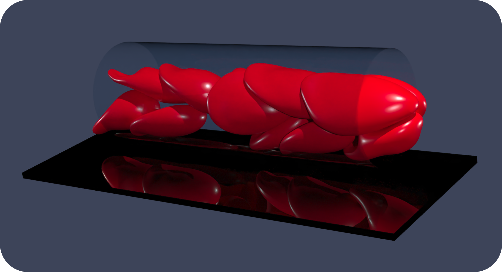

<p align="center">
  
</p>
<p align="center">
  <a href="https://zenodo.org/badge/latestdoi/412637841">
    
  </a>
</p>

# RBC3D
### Spectral boundary integral solver for cell-scale flows

__Authors:__ S. H. Bryngelson, H. Zhao, A. Isfahani, J. B. Freund

RBC3D is a flow solver for soft capsules and cells via the methods discussed in [Zhao et al., JCP (2010)](https://doi.org/10.1016/j.jcp.2010.01.024) and more.
This codebase solves the boundary integral form of the Stokes equations via an algorithm tailored for cell-scale simulations:

* Spectrally-accurate spherical harmonics represent the deforming surfaces
* Modified Green’s function approximation used for near-range interactions
* Electrostatic-like repulsion prevents cells from intersecting
* Weak-formulation of no-slip boundary conditions (e.g., vessel walls)
* These features ensure that simulations are robust. Parallel communication via MPI enables large simulations, such as model vascular networks.

### Installation

<p align="left">
  <a href="https://github.com/comp-physics/RBC3D/actions/workflows/phoenix.yml">
    
  </a>
  <a href="https://github.com/comp-physics/RBC3D/actions/workflows/ice.yml">
    
  </a>
</p>

To install on PACE Phoenix, you need to salloc a node to make sure `srun` is available and then run this in the RBC3D root directory: 

```shell
module load gcc/12.1.0-qgxpzk mvapich2/2.3.7-733lcv python/3.9.12-rkxvr6 netcdf-fortran cmake
./rbc.sh install-phoenix
```

Note that if the `gcc`, `mvapich2`, `mkl`, and `fftw` modules work on your Phoenix account, you should use this installer script for a faster build.
```shell
module load gcc mvapich2 mkl python/3.9.12-rkxvr6 netcdf-fortran fftw cmake
./rbc.sh install
```

Or if you're on the ICE cluster, you just need to load different modules to run the installer script.

```shell
module load gcc/12.3.0 mvapich2/2.3.7-1 netcdf-c hdf5/1.14.1-2-mva2 intel-oneapi-mkl/2023.1.0 python/3.10.10 fftw/3.3.10-mva2 cmake
./rbc.sh install-ice
```

Before you can run cmake, you must set these environment variables. You can place them in your `~/.bashrc`. If you didn't place `RBC3D` in your `$HOME` directory, then replace it with where you placed `RBC3D`.
```shell
export PETSC_DIR=$HOME/RBC3D/packages/petsc-3.19.6
export PETSC_ARCH=arch-linux-c-opt
```

Then to execute and run a case, you can:
```shell
mkdir build
cd build
cmake ..
make case # or just `make` to make common and all the cases
cd case
srun -n 1 ./initcond # or mpiexec
srun ./tube
```

This will generate output files in `build/case/D`. To keep output files in `examples/case/D`, you can `cd examples/case` and `srun ../../build/case/initcond` and same for tube.

To run a case with more cells, you should use a supercomputing cluster. Instructions on how to build RBC3D on a cluster are [available here](https://github.com/comp-physics/RBC3D/blob/master/install/readme.md).


### Papers that use RBC3D

This is an attempt to document the papers that make use of RBC3D.

* Zhao, H., Isfahani, A. H., Olson, L. N., & Freund, J. B. (2010). A spectral boundary integral method for flowing blood cells. Journal of Computational Physics, 229(10), 3726-3744. https://doi.org/10.1016/j.jcp.2010.01.024
* Freund, J. B., & Orescanin, M. M. (2011). Cellular flow in a small blood vessel. Journal of Fluid Mechanics, 671, 466-490. https://doi.org/10.1017/S0022112010005835
* Isfahani, A. H., & Freund, J. B. (2012). Forces on a wall-bound leukocyte in a small vessel due to red cells in the blood stream. Biophysical journal, 103(7), 1604-1615. https://doi.org/10.1016/j.bpj.2012.08.049
* Freund, J. B., & Shapiro, B. (2012). Transport of particles by magnetic forces and cellular blood flow in a model microvessel. Physics of fluids, 24(5), 051904. https://doi.org/10.1063/1.4718752 
* Freund, J. B. (2013). The flow of red blood cells through a narrow spleen-like slit. Physics of Fluids, 25(11), 110807. https://doi.org/10.1063/1.4819341 
* Freund, J. B., & Vermot, J. (2014). The wall-stress footprint of blood cells flowing in microvessels. Biophysical Journal, 106(3), 752-762. https://doi.org/10.1016/j.bpj.2013.12.020
* Boselli, F., Freund, J. B., & Vermot, J. (2015). Blood flow mechanics in cardiovascular development. Cellular and Molecular Life Sciences, 72, 2545-2559.  https://doi.org/10.1007/s00018-015-1885-3
* Bryngelson, S. H., & Freund, J. B. (2018). Global stability of flowing red blood cell trains. Physical Review Fluids, 3(7), 073101. http://doi.org/10.1103/PhysRevFluids.3.073101
* Bryngelson, S. H., & Freund, J. B. (2018). Floquet stability analysis of capsules in viscous shear flow. Joural of Fluid Mechanics, 852, 663–677. http://doi.org/10.1017/jfm.2018.574
* Bryngelson, S. H., & Freund, J. B. (2019). Non-modal Floquet stability of a capsule in large amplitude oscillatory extension. European Journal of Mechanics B/Fluids, 77, 171–176. http://doi.org/10.1016/j.euromechflu.2019.04.012
* Bryngelson, S. H., Guéniat, F., & Freund, J. B. (2019). Irregular dynamics of cellular blood flow in a model microvessel. Physical Review E, 100, 012203. http://doi.org/10.1103/PhysRevE.100.012203

### License

MIT.
