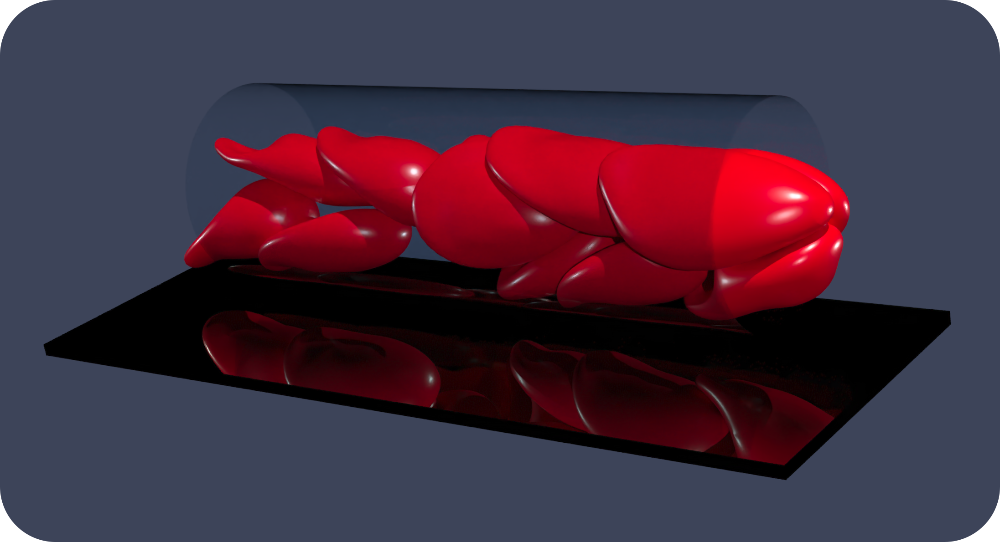

  

  

# RBC3D
### Spectral boundary integral solver for cell-scale flows

__Authors:__ S. H. Bryngelson, H. Zhao, A. Isfahani, J. B. Freund

RBC3D is a flow solver for soft capsules and cells via the methods discussed in [Zhao et al., JCP (2010)](https://doi.org/10.1016/j.jcp.2010.01.024) and more.
This codebase solves the boundary integral form of the Stokes equations via an algorithm tailored for cell-scale simulations:

* Spectrally-accurate spherical harmonics represent the deforming surfaces
* Modified Green’s function approximation used for near-range interactions
* Electrostatic-like repulsion prevents cells from intersecting
* Weak-formulation of no-slip boundary conditions (e.g., vessel walls)
* These features ensure that simulations are robust. Parallel communication via MPI enables large simulations, such as model vascular networks.

### Installation

Building RBC3D can be a fragile process and we are working on improving it.
In the meantime, a careful documentation of build instructions [is available here](https://github.com/comp-physics/RBC3D/blob/master/install/readme.md).

### License

MIT.
