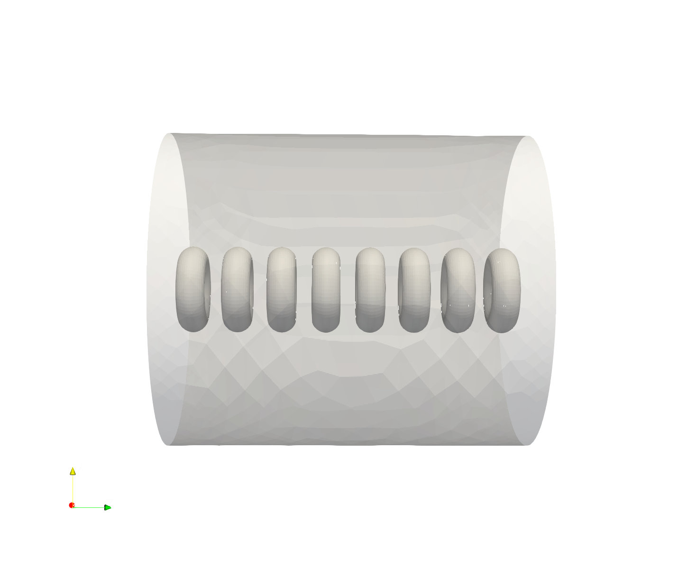

# RBC Example Case

If you visualize the cells in the `case` directory, you will see 8 RBC's in a file because of how `initoncd.F90` sets up the simulation.

## Case Different Cell Types
As of now, the different cell types we have are Leukocytes (aka WBC's) and sickle cells. We also have functions to create spheres and ellipsoids in `ModRbc.F90`.  

When you place a cell, you have to make sure the cell has a celltype number corresponding to the correct reference cell. For example, a RBC with celltype 1 has to have the reference cell at `rbcRefs(1)` created via `RBC_MakeBiConcave`. This is already done.

## Adding WBC's
One way to make sure WBC's are added correctly:
1. In `initcond.F90`, set rbc%celltype to 2 for the cell you want to make a WBC in and pass that rbc object into `RBC_Create()` and `RBC_MakeLeukocyte()`.
2. In `tube.F90`, edit the reference cell array initialization so that the `rbcRefs(2)` is initialized with `RBC_MakeLeukocyte()`.

## Adding Sickle Cells
Sickle cells need a reference cell too, but they're created via the `ImportReadRBC()` function instead. An example is available in `/case_different_celltypes`. 

Note: The ts size in `~/case_different_celltypes/tube.in` is adjusted from .0014 to .00014 so the sickle cell simulation won't break if you run it.
