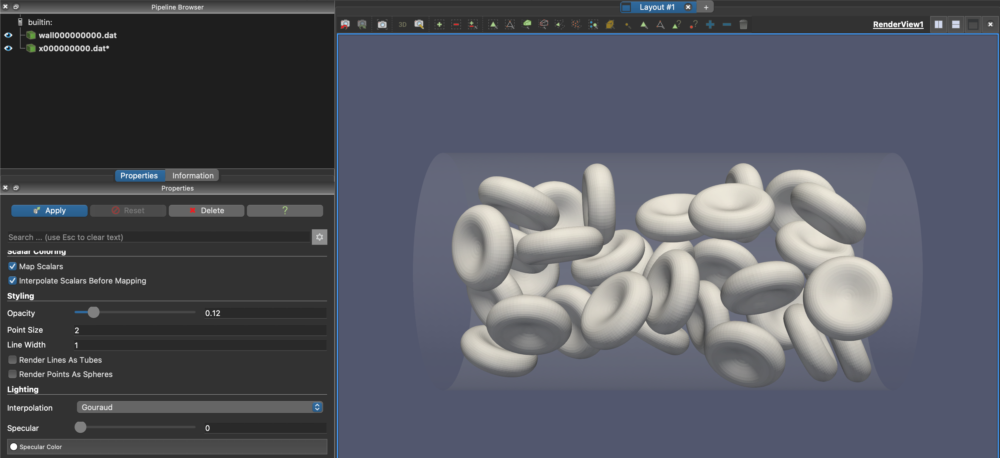
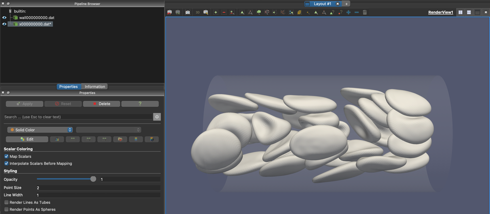
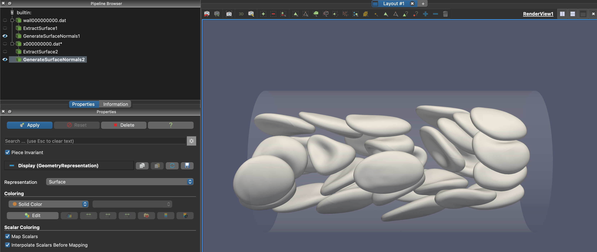
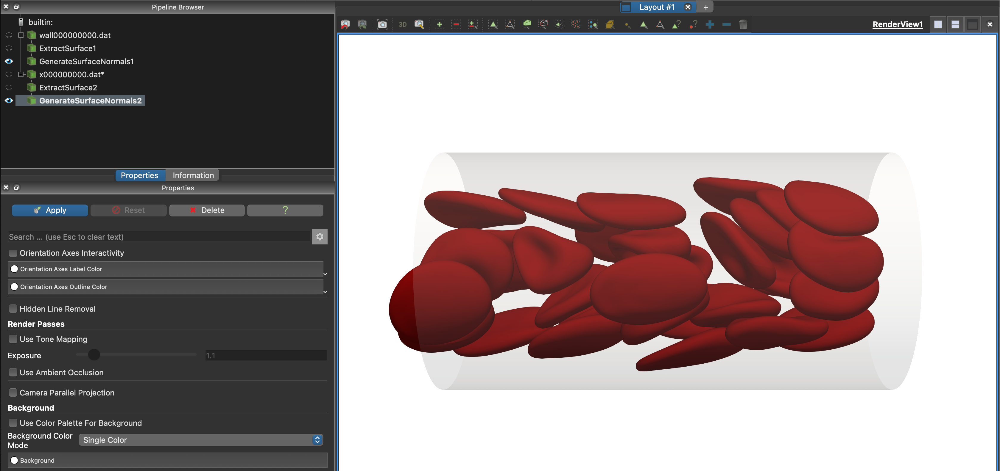
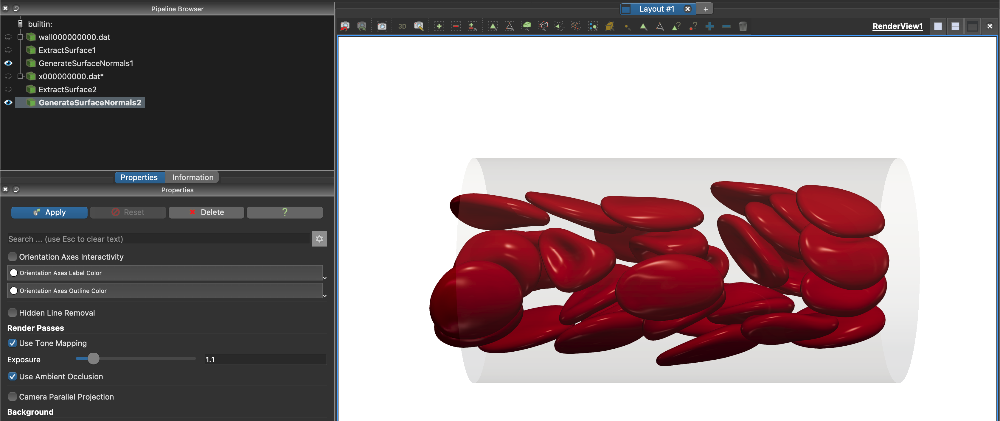
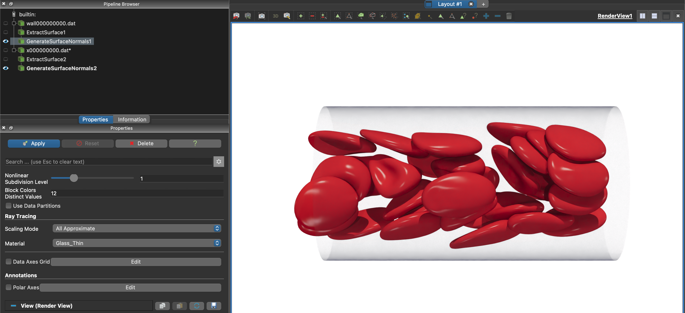
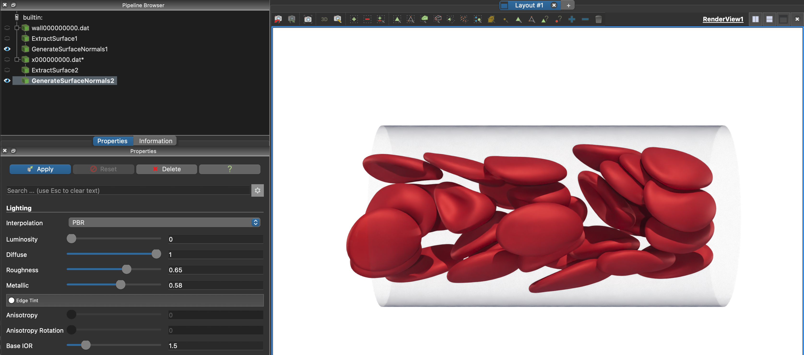
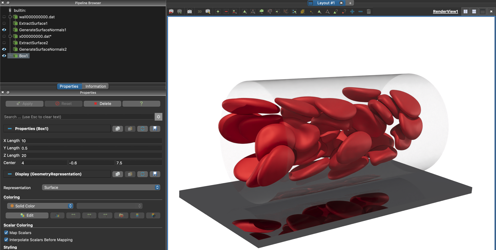
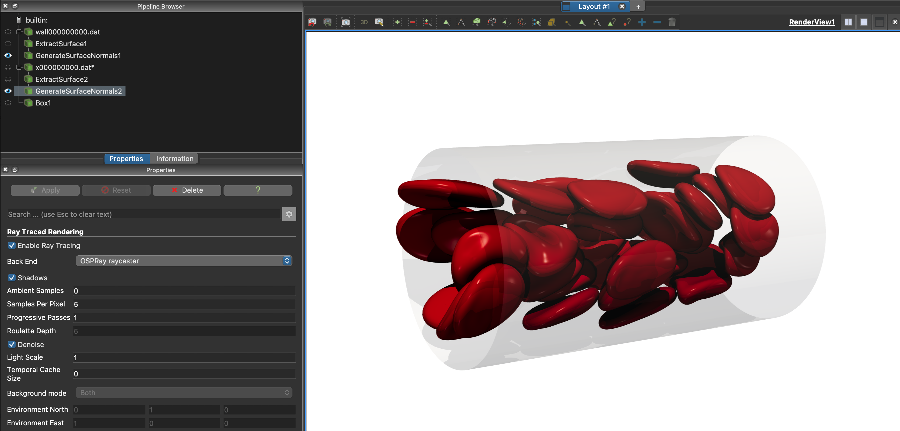

# Visualizing a Simulation

For this visualization tutorial, I ran `examples/randomized_case` with a smaller tube length (15), radius (4), and hematocrit (.18), but you can use any example case file. Then, I downloaded the files onto my local computer. From my local version of Paraview, I clicked open (top left button) and loaded `wall000000000.dat` and `x000000000.dat*` via group import. My window now looks like this after turning the wall opacity down:

Now, you can click the `Play` button at the top to see the cell output at each frame. This is at frame 21 of the simulation I ran. However we can make the visualization look nicer with a few extra steps.

## Smooth Surfaces

The wall and cell surfaces can be smoother if we use the generate surface normals filter. You can apply a filter by pressing `option + space` or `ctrl + space` on your keyboard and then typing in the name of the filter. To fully apply a filter, you have to select `Apply` in `Properties`.

1. Select `wall000000000.dat` in the pipeline browser
2. Select `Apply` in `Properties`
3. Apply `Extract Surface` filter
4. Select `Apply` in `Properties` again
5. Apply `Generate Surface Normals` filter
6. Repeat steps 2-6 with `x000000000.dat*` selected

Now, your pipeline browser and render view should look like this:

## Colors

We can change the color of the cells to red by following these steps:

1. Open the properties panel for `GenerateSurfaceNormals2`
2. Select `Coloring = Solid Color`
3. Select `Edit` and using hex value `#980808` or a similar red color

We can also change the background color to white although I do like paraview blue:

1. Open propties panel and go to `Background`
2. Deselect `Use Color Palette for Background`
3. Select white for background color

Now, our simulation looks like this:

## Ray-tracing and Lighting

Going to the `Lighting` section of the properties panel and turning `Specular` to a higher value will make cells shiny and result in a nicer visualization.

We can also use a few different rendering options to improve it further:

1. Open properties panel
2. Go to `Render Passes` section
3. Click `Use Tone Mapping` and `Use Ambient Occlusion`
4. Click use `Camera Parallel Projection` if you want a flatter look, but I'm keeping it off for this angle

To get started with ray-tracing the simulation, you can:

1. Open properties panel and go to the `Ray Traced Rendering` section
2. Select `Enable Ray Tracing`
3. Select `OSPRay pathtracer` for the backend
4. Set `Samples Per Pixel` to 5 or higher to get rid of graininess in the rendered image
5. Set `Background Mode` to `Both` to keep whatever background you had previously
6. Select `GenerateSurfaceNormals1` to get the wall
7. Go to `Ray Tracing` section
8. Select `Glass_thin` under the `Material` dropdown or another suitable material
    * Note that you can add a material to the cells too if it doesn't change their color. `Value Indexed` works.

Now, our simulation looks like this:

I can use a more advanced lighting interpolation called `PBR` instead of `Gouraud` to make the cells look different:

## Adding a Reflective Surface (Box)

We can add a box underneath our tube so the cells have something to reflect off of. You can add this by typing `options + space + Box`, and then setting the box dimensions based off of your tube size. These are the dimensions I used:

I also changed the material of the box to something reflective, specifically `Metal_Lead_mirror`, but there might be a better material. 

There are lots more Paraview options that you can change, but these are the basics! Ray-tracing takes up a lot of resources, so you might want to follow the remote visualization instructions [here](https://github.com/comp-physics/Scientific-Visualization?tab=readme-ov-file) if you're getting screenshots for a full simulation video. The `OSPRay raycaster` with `Shadows` turned on is a less intensive ray-tracer but still provides some visual interest.

