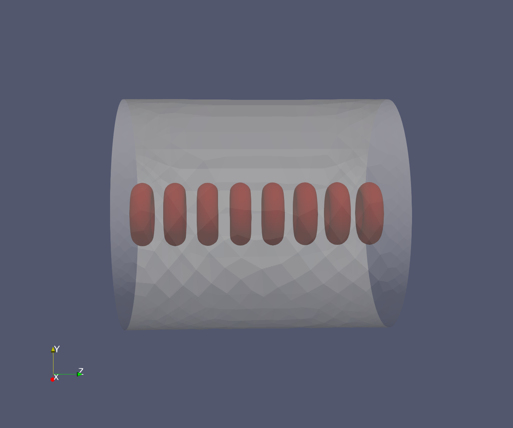
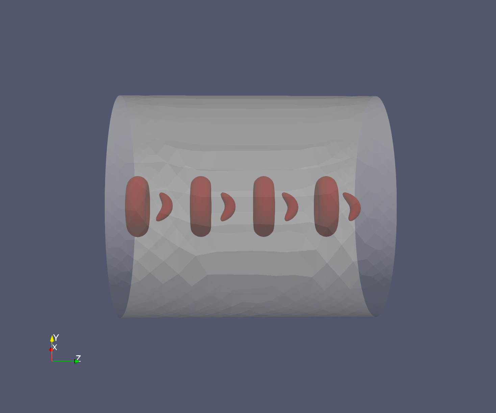

# RBC Example Case

If you visualize the cells in the `case` directory, you will see 8 RBC's in a file because of how `initoncd.F90` sets up the simulation.

  

## Case Different Cell Types
As of now, the different cell types we have are Leukocytes (aka WBC's) and sickle cells. We also have functions to create spheres and ellipsoids in `ModRbc.F90`.

In this example, celltype 1 corresponds to RBC's, celltype 2 corresponds to Leukocytes, and cell type 3 are sickle cells. To run a simulation with these cells, the timestep in `/case_diff_celltypes/Input/tube.in` needs to be adjusted to approximately ~0.00014 for sickle cells and ~0.0008 for leukocytes.

  

